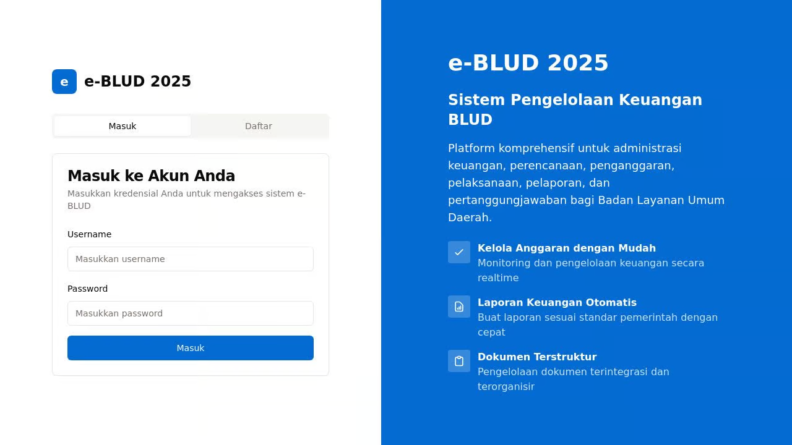

# e-BLUD: Sistem Pengelolaan Keuangan BLUD

Aplikasi e-BLUD adalah sistem manajemen keuangan komprehensif yang dirancang khusus untuk Badan Layanan Umum Daerah (BLUD). Sistem ini memfasilitasi administrasi keuangan yang efisien, transparan, dan akuntabel.


## Tentang Aplikasi

e-BLUD menyediakan platform terpadu untuk mengelola seluruh siklus keuangan BLUD, dari perencanaan hingga pertanggungjawaban. Dengan antarmuka yang intuitif dan fitur-fitur komprehensif, e-BLUD membantu pengelola BLUD dalam:

- Menyusun rencana kerja dan anggaran
- Mengelola proses penganggaran
- Melaksanakan kegiatan operasional
- Mengelola administrasi keuangan
- Menyusun laporan keuangan
- Mempertanggungjawabkan penggunaan dana

## Fitur Utama

### 1. Modul Perencanaan
- Penyusunan Rencana Strategis (Renstra)
- Penyusunan Rencana Bisnis Anggaran (RBA)
- Perencanaan Kegiatan Tahunan
- Penetapan Indikator Kinerja

### 2. Modul Penganggaran
- Penyusunan Anggaran Pendapatan dan Belanja
- Pengelolaan Revisi Anggaran
- Penetapan Dokumen Pelaksanaan Anggaran (DPA)
- Pencairan Anggaran

### 3. Modul Pelaksanaan
- Pengelolaan Pengadaan Barang/Jasa
- Pelaksanaan Kegiatan
- Monitoring Pelaksanaan Kegiatan
- Pengelolaan Kontrak dan Pembayaran

### 4. Modul Penatausahaan
- Pengelolaan Kas
- Pencatatan Transaksi Keuangan
- Pengelolaan Aset
- Pengelolaan Utang dan Piutang

### 5. Modul Pelaporan
- Laporan Keuangan Bulanan
- Laporan Keuangan Triwulanan
- Laporan Keuangan Semesteran
- Laporan Keuangan Tahunan

### 6. Modul Pertanggungjawaban
- Penyusunan Laporan Kinerja
- Evaluasi Pencapaian Indikator
- Audit Internal dan Eksternal
- Tindak Lanjut Hasil Audit

### 7. Fitur Tambahan
- Pengelolaan Dokumen
- Manajemen Pengguna
- Dashboard Analitik Keuangan
- Notifikasi dan Pengingat

## Manfaat

1. **Efisiensi**: Mengotomatisasi proses administrasi keuangan, mengurangi waktu dan tenaga yang dibutuhkan.
2. **Transparansi**: Memberikan visibilitas penuh terhadap seluruh proses keuangan.
3. **Akuntabilitas**: Memudahkan audit dan pelaporan, meningkatkan pertanggungjawaban.
4. **Kepatuhan**: Memastikan kepatuhan terhadap regulasi dan standar yang berlaku.
5. **Pengambilan Keputusan**: Menyediakan data dan analitik untuk pengambilan keputusan yang lebih baik.

## Pengembangan

Aplikasi ini dikembangkan menggunakan teknologi modern:

- **Frontend**: React, Tailwind CSS, shadcn/ui
- **Backend**: Node.js, Express
- **Database**: PostgreSQL (dengan dukungan in-memory untuk pengembangan)
- **Autentikasi**: Passport.js dengan session-based authentication

## Penggunaan

1. **Login/Register**: Akses sistem dengan kredensial yang diberikan, atau daftar jika Anda adalah pengguna baru.
2. **Dashboard**: Lihat informasi keuangan penting dan aktivitas terbaru.
3. **Modul**: Akses modul sesuai kebutuhan melalui sidebar navigasi.
4. **Kelola Data**: Masukkan, edit, dan lihat data melalui form yang disediakan.
5. **Laporan**: Hasilkan dan unduh laporan sesuai kebutuhan.

## Untuk Pengembangan Lokal

```bash
# Clone repository
git clone <repository-url>

# Install dependencies
npm install

# Run development server
npm run dev
```

## Informasi Kontak

Untuk informasi lebih lanjut tentang e-BLUD atau bantuan teknis, silakan hubungi:

Pusat Pendidikan dan Pelatihan (Pusdiklat) Pemda
Email: info@pusdiklatpemda.go.id
Telepon: (021) XXX-XXXX

---

habizinnia@gmail.com
